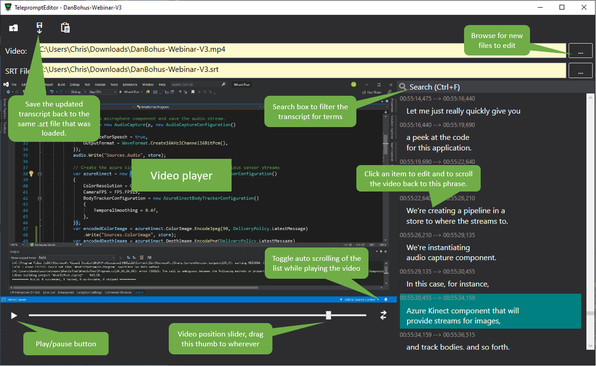
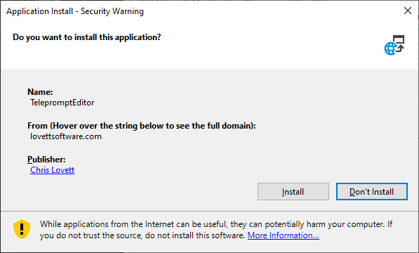

# TelepromptEditor

This is a simple WPF application that is designed to edit SRT files containing transcript of a video.

Simply set a Video URL in the Video text box and the location
of the SRT file in the "SRT File" text box and the transcript
will automatically sync as the video plays or as you move
the slider.

Click on the SRT list entry to edit the contents.  When you are
done click the save button on the toolbar to save the updated
SRT file.

## Installation

To install the app follow this [Clickonce Install Link](http://lovettsoftware.com/downloads/TelepromptEditor/setup.exe).

Your web browser will download this file which you can then open.
You should see the following dialog:

Please be sure to check the "Publisher" is listed as "Chris Lovett".

## Questions

For questions and issues please use the
[github issues list](https://github.com/lovettchris/TelepromptEditor).
